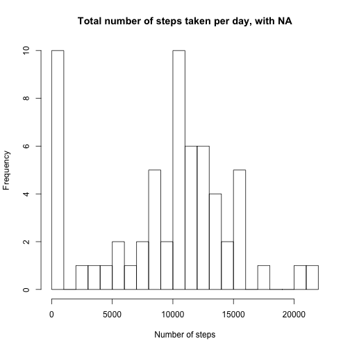
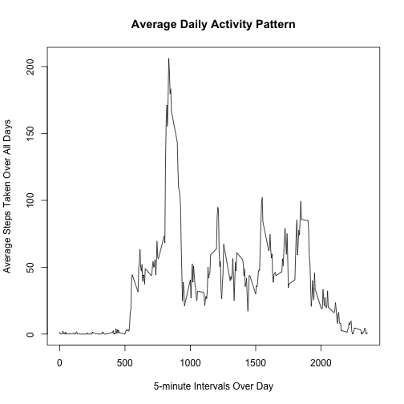
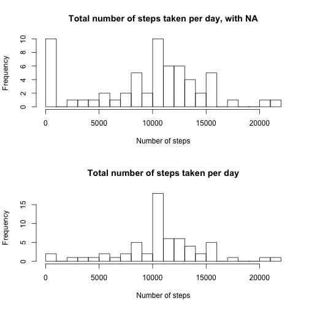

# Reproducible Research: Peer Assessment 1


## Loading and preprocessing the data

"activity.csv" file must be present in the current working directory. While loading the data, we make sure that the second column is interpreted as Date field.

```r
setwd("~/Downloads/ocw/DataScienceSpecialization/repdata-002/project/01/RepData_PeerAssessment1")
```

1. Load the data (i.e. read.csv())
2. Process/transform the data (if necessary) into a format suitable for your analysis


```r
data <- read.csv("./activity.csv", sep = ",", head = T, colClasses = c("integer", 
    "Date", "integer"))
summary(data)
```

```
##      steps            date               interval   
##  Min.   :  0.0   Min.   :2012-10-01   Min.   :   0  
##  1st Qu.:  0.0   1st Qu.:2012-10-16   1st Qu.: 589  
##  Median :  0.0   Median :2012-10-31   Median :1178  
##  Mean   : 37.4   Mean   :2012-10-31   Mean   :1178  
##  3rd Qu.: 12.0   3rd Qu.:2012-11-15   3rd Qu.:1766  
##  Max.   :806.0   Max.   :2012-11-30   Max.   :2355  
##  NA's   :2304
```


## What is mean total number of steps taken per day?

For this part of the assignment, you can ignore the missing values in the dataset.

1. Make a histogram of the total number of steps taken each day

```r
# We ignore NA values by na.rm = T
stepsPerDay <- sapply(split(data$steps, data$date), sum, na.rm = T)
firstHist <- function() {
    par(bg = "white")
    hist(stepsPerDay, main = "Total number of steps taken per day, with NA", 
        xlab = "Number of steps", breaks = 20, bg = "white")
}
firstHist()
```

 


2. Calculate and report the mean and median total number of steps taken per day

```r
meanSPD <- mean(stepsPerDay)
medianSPD <- median(stepsPerDay)
paste0("Total number of steps taken per day's mean is ", meanSPD, " and its median is ", 
    medianSPD)
```

```
## [1] "Total number of steps taken per day's mean is 9354.22950819672 and its median is 10395"
```


## What is the average daily activity pattern?


1. Make a time series plot (i.e. type = "l") of the 5-minute interval (x-axis) and the average number of steps taken, averaged across all days (y-axis)

```r
meanByInterval <- aggregate(steps ~ interval, data = data, FUN = mean)
par(bg = "white")
plot(meanByInterval, type = "l", main = "Average Daily Activity Pattern", xlab = "5-minute Intervals Over Day", 
    ylab = "Average Steps Taken Over All Days")
```

 


2. Which 5-minute interval, on average across all the days in the dataset, contains the maximum number of steps?

```r
maxSteps <- max(meanByInterval$steps)
maxIndex <- which.max(meanByInterval$steps)
maxStepRow <- meanByInterval[maxIndex, ]
meanByInterval[maxIndex, ]
```

```
##     interval steps
## 104      835 206.2
```

```r
paste0("Maximum number of steps taken in a 5 minute interval is in ", maxStepRow$interval, 
    " minute interval that contains the mean of ", maxStepRow$steps, " number of steps")
```

```
## [1] "Maximum number of steps taken in a 5 minute interval is in 835 minute interval that contains the mean of 206.169811320755 number of steps"
```


## Imputing missing values

Note that there are a number of days/intervals where there are missing values (coded as NA). The presence of missing days may introduce bias into some calculations or summaries of the data.

1. Calculate and report the total number of missing values in the dataset (i.e. the total number of rows with NAs)

```r
total_na_rows <- sum(is.na(data))
paste0("Total number of rows with NAs = ", total_na_rows)
```

```
## [1] "Total number of rows with NAs = 2304"
```


2. Devise a strategy for filling in all of the missing values in the dataset. The strategy does not need to be sophisticated. For example, you could use the mean/median for that day, or the mean for that 5-minute interval, etc.
3. Create a new dataset that is equal to the original dataset but with the missing data filled in.

Here we will be imputing the data by finding the 5 minute interval the NA step value is related with. Then, we will use the mean value of that interval as the number of steps taken.


```r
processedData <- data
# fill in NAs with the mean for that 5-minute interval
for (i in 1:nrow(data)) {
    row <- data[i, ]
    if (is.na(row$steps)) {
        rowMax <- which.max(row$interval == meanByInterval$interval)
        processedData$steps[i] <- meanByInterval$steps[rowMax]
    }
}

summary(processedData)
```

```
##      steps            date               interval   
##  Min.   :  0.0   Min.   :2012-10-01   Min.   :   0  
##  1st Qu.:  0.0   1st Qu.:2012-10-16   1st Qu.: 589  
##  Median :  0.0   Median :2012-10-31   Median :1178  
##  Mean   : 37.4   Mean   :2012-10-31   Mean   :1178  
##  3rd Qu.: 27.0   3rd Qu.:2012-11-15   3rd Qu.:1766  
##  Max.   :806.0   Max.   :2012-11-30   Max.   :2355
```


4. Make a histogram of the total number of steps taken each day and Calculate and report the mean and median total number of steps taken per day. Do these values differ from the estimates from the first part of the assignment? What is the impact of imputing missing data on the estimates of the total daily number of steps?

To make the comparison easier, we will be plotting the histograms together.


```r
stepsPerDayNoNAs <- sapply(split(processedData$steps, processedData$date), sum, 
    na.rm = T)
par(mfrow = c(2, 1))
firstHist()
par(bg = "white")
hist(stepsPerDayNoNAs, main = "Total number of steps taken per day", xlab = "Number of steps", 
    breaks = 20, bg = "white")
```

 

```r
summary(stepsPerDay)
```

```
##    Min. 1st Qu.  Median    Mean 3rd Qu.    Max. 
##       0    6780   10400    9350   12800   21200
```

```r
summary(stepsPerDayNoNAs)
```

```
##    Min. 1st Qu.  Median    Mean 3rd Qu.    Max. 
##      41    9820   10800   10800   12800   21200
```


One can see from the histograms and the summary outputs that the mean and median values have increased as a result of imputing.

## Are there differences in activity patterns between weekdays and weekends?

For this part the weekdays() function may be of some help here. Use the dataset with the filled-in missing values for this part.

1. Create a new factor variable in the dataset with two levels – “weekday” and “weekend” indicating whether a given date is a weekday or weekend day.

```r
typeOfDay <- function(day) {
    if (weekdays(day) %in% c("Saturday", "Sunday")) {
        "weekend"
    } else {
        "weekday"
    }
}

processedData$typeOfDay <- sapply(processedData$date, typeOfDay)
```

2. Make a panel plot containing a time series plot (i.e. type = "l") of the 5-minute interval (x-axis) and the average number of steps taken, averaged across all weekday days or weekend days (y-axis). The plot should look something like the following, which was creating using simulated data:


```r
library(lattice)
meanByMulti <- aggregate(processedData$steps, by = list(processedData$interval, 
    processedData$typeOfDay), mean)
names(meanByMulti) <- c("interval", "typeOfDay", "steps")
xyplot(steps ~ interval | typeOfDay, meanByMulti, type = "l", layout = c(1, 
    2), xlab = "Interval", ylab = "Number of steps")
```

 

```r

```


Weekends have a more uniform distribution while weekdays have a distinct peak earlier during the day that dwarfs the number of steps taken for the remainder of the day. This is somewhat expected as more people tend to go jogging earlier in the morning and do not engage in any other exercise during the day for the weekdays. People are more free to use their time as they wish during the weekends and therefore the distribution is more uniform according to our data.

